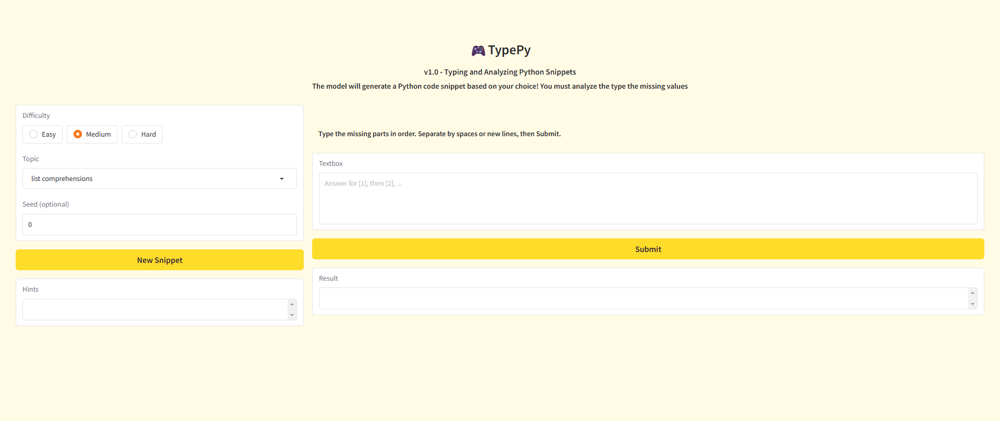

# TypePY

> **Practice and learn Python fundamentals** through AI-generated "fill-in-the-blank" challenges.

This tool uses a **Gradio** interface to power a simple UI, integrating with a **codegen LLM** to create unique Python code snippets. It then uses Python's `tokenize` module to intelligently create "blanks" for you to fill in.

Test your knowledge, get instant feedback from the **built-in checker**, and track your progress with the **scoring system**.

## Features

* **AI-Powered Challenges:** Uses a code-generation LLM for an endless supply of unique Python exercises.
* **"Fill-in-the-Blank" Format:** Focuses on understanding syntax and logic by completing code snippets.
* **Instant Feedback:** A built-in checker immediately validates your answers.
* **Scoring System:** Track your progress and challenge yourself to improve.
* **Focus on Fundamentals:** Designed to strengthen core Python knowledge.

## How It Works (Tech Stack)

This application combines three key components:

1.  **Gradio:** Provides the fast, simple web interface.
2.  **Codegen LLM:** A Large Language Model ([Specify LLM, e.g., CodeLlama, etc.]) generates the base Python code.
3.  **Python `tokenize` Algorithm:** This standard library module is used to parse the AI-generated code, identify tokens to turn into "blanks," and validate the user's input.

## User Interface

## Running on HuggingFace Space
You can try the live demo on my Hugging Face Space

